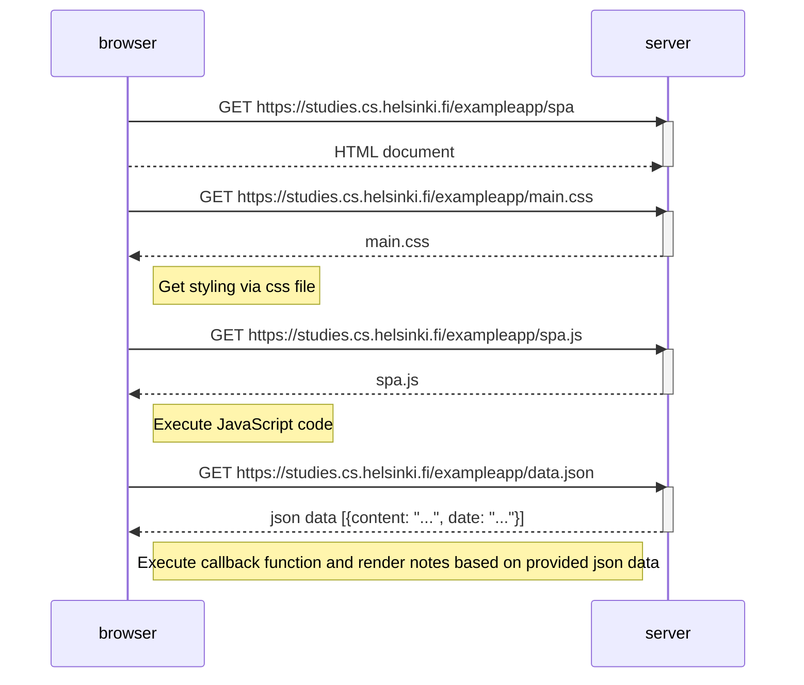

```mermaid

sequenceDiagram
    participant browser
    participant server

    browser->>server: GET https://studies.cs.helsinki.fi/exampleapp/spa
    activate server
    browser-->>server: HTML document
    deactivate server

    browser->>server: GET https://studies.cs.helsinki.fi/exampleapp/main.css
    activate server
    server-->>browser: main.css
    deactivate server

    Note right of browser: Get styling via css file

    browser->>server: GET https://studies.cs.helsinki.fi/exampleapp/spa.js
    activate server
    server-->>browser: spa.js
    deactivate server

    Note right of browser: Execute JavaScript code

    browser->>server: GET https://studies.cs.helsinki.fi/exampleapp/data.json
    activate server
    server-->>browser: json data [{content: "...", date: "..."}]
    deactivate server

    Note right of browser: Execute callback function and render notes based on provided json data

```