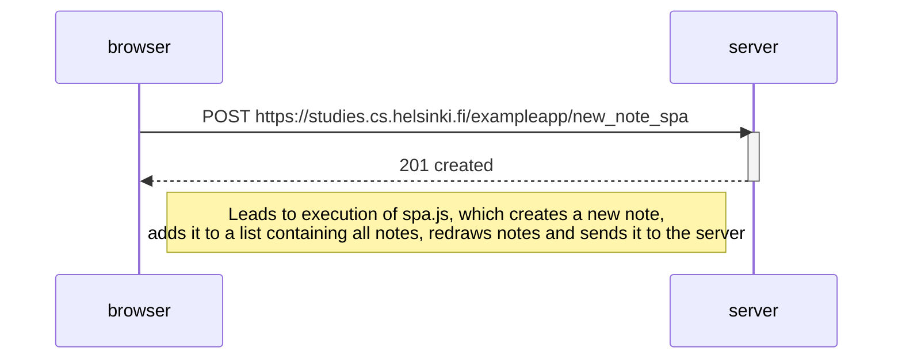

```mermaid

sequenceDiagram
    participant browser
    participant server

    browser->>server: POST https://studies.cs.helsinki.fi/exampleapp/new_note_spa
    activate server
    server-->>browser: 201 created
    deactivate server

    Note right of browser: Leads to execution of spa.js, which creates a new note, <br> adds it to a list containing all notes, redraws notes and sends it to the server

```
